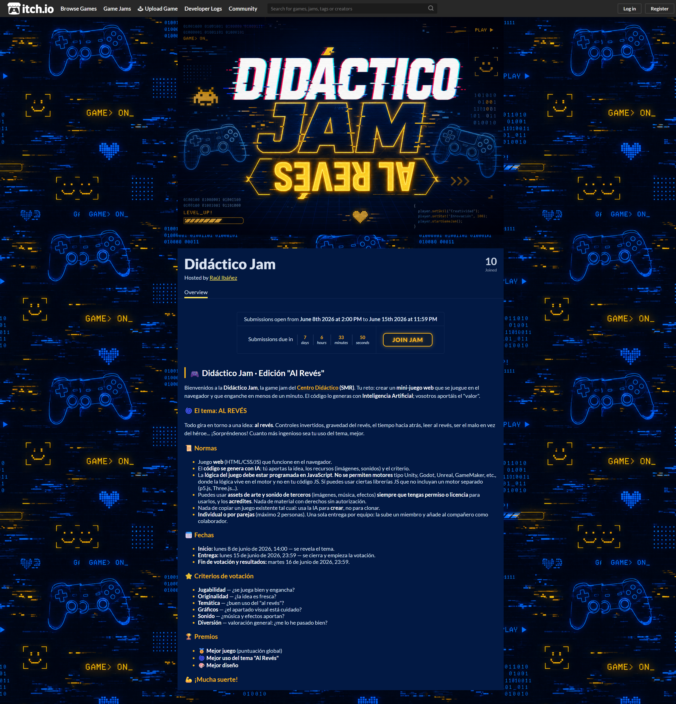

# 👻 Ghost Hunters: Reversed

Mini-juego web de terror asimétrico en **primera persona** para la *Didáctico Jam 2026* (tema: **AL REVÉS**).
Juegas como **fantasma** con los **controles de movimiento invertidos** y la **vista en negativo**, sobreviviendo a cazadores controlados por IA.

> **Estado:** R7 — presentación AAA: postprocesado cinematográfico (bloom + grano + viñeta + aberración + grading "el otro lado" en cacería), paneles fluorescentes de techo con flicker, linternas en los cazadores, screen-shake/head-bob/FOV dinámico, partículas (polvo, bursts), audio por capas (zumbido fluorescente que MUERE al empezar la cacería → rumble, latido por proximidad, susurros) y UI rediseñada (CRT/terror analógico). Sobre R6: observación/marcado + derribo/KO/Memento Mori + rutinas.

## El tema "AL REVÉS": inversión como evento (no constante)

En vez de invertir los controles todo el rato (frustrante y mareante), el "AL REVÉS" es un
**glitch espectral puntual**: la mayor parte del tiempo juegas con controles clásicos, pero cada
cierto tiempo —y más adelante, **cuando la linterna del cazador te alcance**— llega un aviso breve
y durante ~3 s tu movimiento se invierte mientras la pantalla cambia a un efecto "del otro lado".
Telegrafíado = desafío justo, no castigo.

## Cómo ejecutar

Usa módulos ES + Three.js por CDN, así que **necesita un servidor local** (no abre por doble clic / `file://`).

```bash
# Opción 1 — Python
python -m http.server 8080

# Opción 2 — Node
npx serve -l 8080
```

Luego abre <http://localhost:8080> y haz click en **JUGAR**.

## Controles (prototipo)

| Tecla | Acción |
|---|---|
| Ratón | Mirar |
| W A S D | Mover |
| `1` / clic | Observar al apuntado (al 100% queda MARCADO: muere de 1 golpe en cacería) |
| `2` | Teletransporte (a donde miras) |
| `3` | Trampa paranormal (en tu celda) |
| `4` | Aparición (señuelo donde miras) |
| `5` | Visión espectral (solo en cacería) |
| `Espacio` | Cacería (si la barra de energía está llena) |
| `E` | Memento Mori sobre un superviviente derribado |
| `O` | Overlay de depuración de la IA |

## Tecnología

- **Three.js 0.160** (vía importmap + CDN, sin build).
- HTML5 + CSS3 + JS vanilla. Lógica visible.
- Entrega prevista: **itch.io**.

## Créditos de assets

- **Personajes:** Quaternius — *Ultimate Animated Character Pack* (CC0). <https://quaternius.com>
- **Entorno:** `backrooms.glb` descargado de **Sketchfab** — _registrar autor + URL y verificar la licencia CC0/CC-BY del modelo concreto antes de publicar en itch.io._
- **Props:** TV vintage, mesa y cruz de madera (Sketchfab) — _misma verificación de licencia pendiente._
- **Música:** `freesound_community-dark-drone-ambient` (Freesound).
- **Tipografías:** VT323 y Special Elite (Google Fonts, OFL).

## Verificación visual (dev)

`node scripts/shot.mjs` (con el servidor en `:8080` y Chrome instalado) abre el juego headless
con `#dbg`, salta el overlay y captura PNGs en `shots/` (menú / normal / cacería / linternas).

## Licencia

_(pendiente de especificar)_
